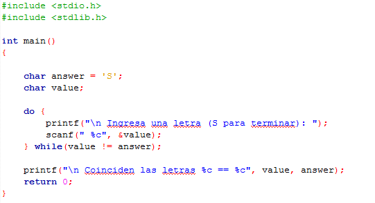

### Clase 13 *Ciclo Do-While*

El Do - While es una estructura de control donde la condición de continuación del ciclo se prueba al final del mismo.

Funciona de manera similar a la estructura while, la diferencia es que esta evalúa al final.

Teniendo en cuenta el siguiente ejemplo:

Inicializamos la variable de tipo carácter answer con el valor de 'S' y declaramos otra variable de tipo carácter, value. Usamos do while para que el usuario ingrese una letra, esto se podrá ir agregando infinitamente hasta que se ingrese el carácter S, obligatoriamente debe ser mayúscula para que se detenga el programa. Y, una vez finalizada el do while, el programa pasa a imprimir que los dos caracteres son iguales.

**RETO**

- Usando do while, imprime los primeros 100 números naturales