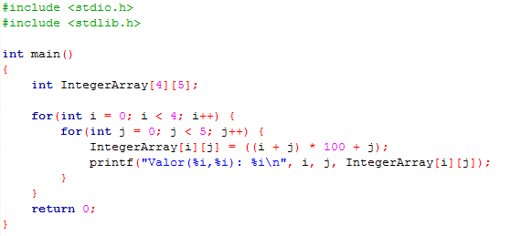

### Clase 17 *Arreglos e iteradores bidimensionales*

Para poder utilizar el iterador for junto con un arreglo bidimensional es necesario entender el concepto de un for anidado.

**Bucle anidado**

Es un bucle que se encuentra incluido en el bloque de sentencias de otro bloque. Los bucles pueden tener cualquier nivel de anidamiento (un bucle dentro de otro bucle dentro de un tercero, etc.). Al bucle que se encuentra dentro del otro se le puede denominar bucle interior o bucle interno. El otro bucle sería el bucle exterior o bucle externo.

En los bucles anidados es importante utilizar variables de control distintas, para no obtener resultados inesperados.

**Bucles anidados con variables independientes**

Los bucles anidados con variables independientes son los bucles en los que ninguna de las variables de uno de los bucles interviene ni en la condición de continuación ni en la expresión de paso de los otros bucles.

**Bucles anidados con variables dependientes**

Los bucles anidados con variables dependientes son los bucles en los que la variable de uno de los bucles interviene en la condición de continuación o en la expresión de paso de los otros bucles.

En nuestro ejemplo:

Declamaros una matriz de 4 x 5, es decir, tendrá 4 filas y 5 columnas, y usamos un bucle anidado con variables independientes. Nuestro primer bucle for representa las filas de la matriz y el segundo bucle for representa las columnas de la matriz.

Su forma de recorrer es la siguiente: nuestro programa inicial al ingresa al primer for y después pasa al segundo for, continua dando vueltas al segundo for hasta completar y sale para dar la vuelta al primer for. Continua sucesivamente de la misma manera hasta terminar ambos bucles.

**RETO**

Crear un arreglo de 5 filas por 6 columnas donde:

- Los primeros 5 elementos de cada fila tengan calificaciones aprobatorias de 6 y 10
- El sexto elemento de cada fila debe ser 0
- Calcula el promedio de los primeros 5 elementos de cada fila y asignarlo al sexto elemento
- Imprime el promedio de cada fila de calificaciones