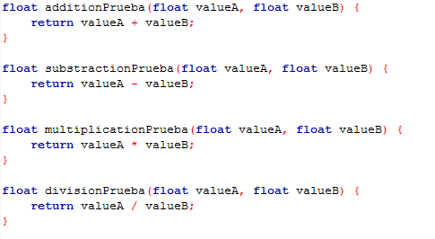
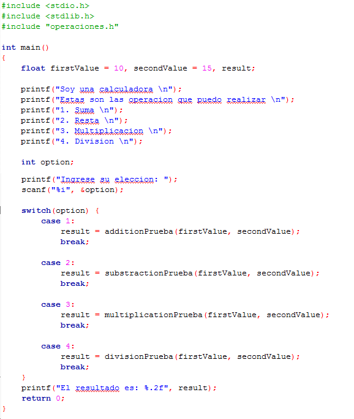

### Clase 27 *Manejo de librerías*

Las librerías son un grupo de archivos que tienen una funcionalidad preconstruidas por terceros, y que puede ser usadas por cualquier ejecutable. Las librerías contienen en su interior variables y funciones, se conoce como librerías (o bibliotecas) a cierto tipo de archivos que podemos importar o incluir en nuestro programa. Estos archivos contienen las especificaciones de diferentes funcionalidades ya construidas y utilizables, como por ejemplo leer del teclado o mostrar algo por pantalla entre muchas otras más. al poder incluir estas librerías con definiciones de diferentes funcionalidades podremos ahorrarnos gran cantidad de cosas.

Nosotros también somos capaces de crear nuestras propias librerías para hacer las operaciones que deseemos. Para hacerlo es necesario tener dos archivos: uno sería el lenguaje c donde estaría nuestro código y otro con la extensión .h que sería nuestra librería, además de que ambos archivos deben estar necesariamente en la misma carpeta.

Haremos una librería básica de prueba que tendrá cuatro operaciones, para eso creamos un archivo llamado "operaciones.h" y ponemos en su interior las cuatro funciones:

Con esto ya está creada la librería. Ahora debemos crear nuestro código que llamara esa librería:

Como vemos, cuando incluimos a nuestra librería recién creada ponemos el nombre entre comillas dobles (" ") en vez del típico < >.

El uso sigue siendo igual que usar una función cualquiera, inicializamos dos variables flotantes llamadas firstValue y secondValue con los valores de 10 y 15, respectivamente. Así como declaramos una variable flotante result que guardara el resultado de nuestra operación y una variable entera llamada option con el que pediremos al usuario que seleccione la operación que desee realizar y manejamos la condición con un switch para finalmente imprimir el resultado.
